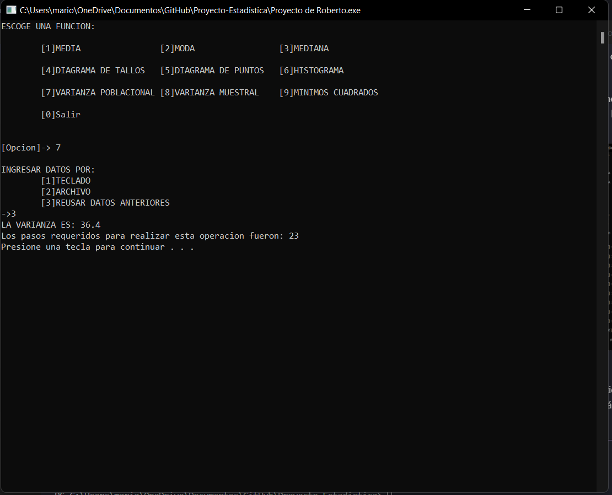

# Proyecto Estadistica

## Introducción

El presente documento presenta la documentación del proyecto del curso de Estadística el cual fue programado en C, con la finalidad de resolver diversos problemas matemáticos que se presentaron durante el curso, dentro los cuales existían:  

1. [Diagrama de tallos y hojas](#opción-1)
2. [Gráfico de puntos](#opción-2)
3. [Histogramas](#opción-3)
4. [Media](#opción-4)
5. [Moda](#opción-5)
6. [Mediana](#opción-6)
7. [Varianza fórmula 1](#opción-7)
8. [Varianza fórmula 2](#opción-8)
9. [Gráfico de mínimos cuadrados](#opción-9)

El código esta compuesto por 15 funciones, las cuales cada una cumple una funcion muy especifica dentro de la compilación del código, tambien fué implementada una estructura de datos en la cua decidí guardar mi conjunto de datos como memoria temporal.

## Estructura del Proyecto

El proyecto se encuentra estructurado de la siguiente manera:

- Proyecto de Roberto.cpp: Archivo principal del proyecto en el cual se encuentran todas las funciones que realizarán los cálculos necesarios para lograr mostrar las gráficas en pantalla.
- mínimos cuadrados.txt: es uno de los archivos con datos para realizar los cálculos de algunos problemas previstos en el desarrollo.
- minimoscraudrados 2.txt: de la misma manera que el documento anterior, sirve para realizar pruebas y ver cómo funciona el programa.
- problema 1.txt: tiene la misma función que los 2 anteriores, solo que este está enfocado a las demás funciones que no son minimos cuadrados.

## Funcionalidades

Al iniciar el programa, lo primero que verás será un menú, en que podrás seleccionar una de las diferentes funcionalidades que el programa ofrece el cual se muestra en la siguiente imagen:

El menú anterior cuenta con 10 opciones diferentes con las cuales tú tendrás la capacidad de interactuar con el programa.

- La primera de ellas es:
MEDIA, el cual es un algoritmo que sirve para obtener el valor de la media después de ingresar algunos valores y la terminal mostrará la media de todos los valores ingresados, tanto por archivo o por teclado.

- La segunda opción que tienes disponible se trata de la MODA, la cual consiste en la misma idea de meter una serie de datos consecutivos para en este caso obtener el número que más se repite de todos.

- La tercera opción es, MEDIANA, de la misma manera que las copias anteriores, se ingresara una serie de números, para posteriormente obtener el valor que se encuentra en medio de todos los valores ingresados.

- La cuarta opción disponible es, el DIAGRAMA DE TALLOS Y HOJAS, el cual consiste de igual forma en trabajar con una serie de datos para poder, obtener los valores del mismo grupo y agruparlos es decir, si tengo 5 números entre el 10 y el 19, todos esos números serán agrupados en una sola sección.

- La quinta opción es, DIAGRAMA DE PUNTOS, el diagrama de puntos consiste en un conteo de la serie de números y agrupar los que se repiten en un gráfico, eso nos ayudará a percibir los datos de manera visual y poder predecir el comportamiento.

- La sexta opción es, HISTOGRAMA la cual nos permitirá visualizar nuestros datos en un gráfico de barras.

- La séptima y la octava son, para calcular la varianza de los datos, cada una con diferentes fórmulas.

- La novena opción, nos permite visualizar dos grupos de datos al mismo tiempo, pero en este caso ajustados a una sola gráfica recta, con ajuste cuadrático.

-Y la última de las opciones nos permitirá salir del programa.

## Uso del programa

Para comenzar programa puedes elegir cualquiera de las opciones antes mencionadas, pero para comenzar la explicación se mostrarán las opciones en orden para que logres ver la funcionalidad de cada una de ellas.

### Opción 1: Media
En primera instancia la siguiente imagen muestra un ejemplo de cómo funciona la opcion número 1 del menú:

Como se puede observar a simple vista, seleccione las opciones 1-1 e ingrese los valores por teclado y obtuve la media.

### Opción 2: Moda

La segunda imagen es muestra el funcionamiento de la opción consiguiente:

De igual forma que el código anterior es necesario que sean ingresados diferentes valores para realizar los cálculos y en este caso, solo se calculo la moda, y como se puede observar, el número más repetido fue el número 10

### Opción 3: Mediana

Como tercera opción tienes la posibilidad de calcular la mediana, únicamente ingresando los números por teclado y presionando el botón enter, en la siguiente imagen se muestra un ejemplo de cómo se realiza:

Esta opción como ya fue mencionado anteriormente, es muy útil para saber cual es el valor que se encuentra en medio de todos los valores.

### Opción 4: Diagrama de Tallos y Hojas

La cuarta funcionalidad tiene una funcionalidad similar, solo que en este caso tienes la posibilidad de visualizar los resultados en un diagrama, y de igual manera, tendrás que ingresar los números por teclado o a través de un archivo, el funcionamiento es el siguiente:

Y como puedes observar tienes la posibilidad de ver los números de una manera muy ordenada.

### Opción 5: Diagrama de Puntos

La quinta opción funciona similar a las anteriores, solo que en esta opción tendrás la posibilidad de visualizar los datos repetidos en un gráfico de puntos:

Solo ingresas los números y el diagrama se genera automáticamente.

### Opción 6: Histogramas

La sexta opción de igual manera en base a una serie de datos, tiene la funcionalidad de graficar un histograma o gráfico de barras de la siguiente forma:

### Opción 7: Varianza Poblacional

En la séptima opción el funcionamiento es similar que en las anteriores pero en este caso solo se realizará el cálculo de la varianza se ve de la siguiente manera:

Tendrás la opción de utilizar los datos utilizados en el cálculo anterior después de haber ejecutado uno anteriormente.

### Opción 8: Varianza Muestral

La opción 8 es prácticamente igual, solo que en el cálculo se utilizan algunos parámetros diferentes:

### Opción 9: Minimos Cuadrados

La opción 9 tiene la funcionalidad de realizar un ajuste de mínimos cuadrados a un conjunto de datos, que de igual forma serán ingresados por teclado o por un documento y funciona de la siguiente manera:

### Opción 10: Salir

La opción 10 solo sirve para salir del programa
